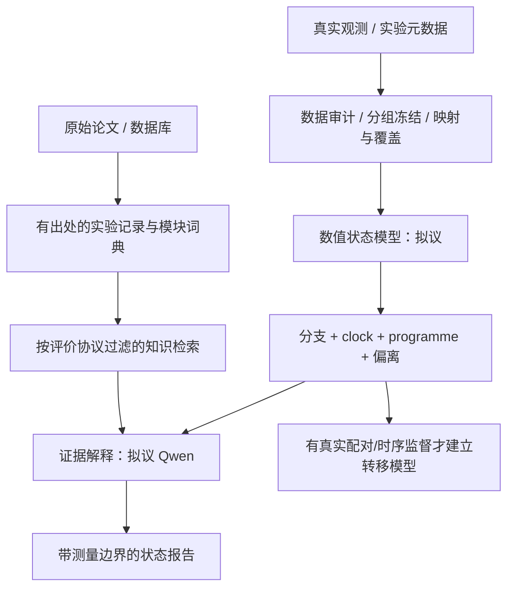

# 组织架构与评价协议草案

## 当前仓库与未来计算组件

现在只实现 `knowledge/`、来源快照、定义文档及校验工具。图中数值模型、检索解释与转移训练都是后续设计，没有用空 Python 类伪装成已实现组件。

## 四类对象

| 对象 | 定义 | 不能替代什么 |
| --- | --- | --- |
| 功能模块 M01–M14 | 任务与观测的组织目录 | 不是基因集合、独立因果变量或 14 个模型 |
| Programme | 实际成员及权重、符号、版本、覆盖率明确的表达程序 | 不是自动测得的通路活性 |
| Clock | 背景和分支内、锚点及训练来源明确的分子位置 | 不是通用时长、深度、年龄或周期振荡 |
| Outcome | 有实验操作定义的恢复／存活／功能 readout | 不从表达或文献推理自动补出 |

未来每个 programme 必须输出实际 genes/weights、样本分数、映射证据、缺失掩码与单位；数据学习的 programme 另记录训练 split、bootstrap 稳定性及版本。模块与 programme 的连边为多对多，不能仅由富集名称决定。K13、M4 等用户内部对象未导入。

## 状态表示

`state = {context, branch, progress, observed_programmes, deviations, history, functional_outcomes, uncertainty}`。

- context：物种、株系、发育阶段、细胞类型、组织、测量尺度与处理背景。
- branch：预备/进入、维持、终止、终止后静息、恢复或未知；原研究术语保留，按证据映射，不要求每个系统都有全部阶段。
- progress：过程特定坐标及训练锚点。无标签或不适用时为空；不默认截断为 0–1。
- history：实测休眠时长、先前条件与刺激历史。缺失是缺失。
- outcomes：恢复延迟/比例、生存或功能终点；无对应实验则 unavailable。

“功能深度”要由标准刺激下的响应定义，并保留刺激剂量、时长和判定终点。不同实验刺激不可直接共用深度标尺。死亡是竞争结局，不能作为更深的休眠。

## 数据和知识分层

核心是胚胎 diapause 与 reactivation；昆虫 diapause 独立保留 life stage 与内分泌条件。Dauer、哺乳动物 quiescence、酵母 G0/spore 可供机制迁移；植物种子、微生物 persister/spore、冬眠/torpor 和肿瘤 dormancy 先进入扩展检索目录。后者不是核心 clock 训练标签。衰老停滞、普通应激、正常发育等是区分性参照。

来源摘要是文献阅读笔记，不是审核后的 SFT。每条必须区分 RNA 关联、蛋白／代谢测量、功能 readout、实验干预与计算预测；GO/Reactome 注释本身不证明某机制在 diapause 生效。相反方向保留背景，不做投票平均。

## 冻结与泄漏防护

按论文家族（预印本、正式稿、补充资料、再分析共享）、研究、原始实验单位分组。一个单位的细胞、池、噪声版本和衍生 programme 不跨 split。无法解析 donor/embryo/culture 时保守地整批合组，并标注独立性不明。

最终内部 killifish 同时隔离表达、K13/M4、结果文本、thesis 中对应结果、补充表与检索索引。已参与设计的知识要记录，不能称完全盲测。将来独立测试论文的结果也从训练和测试时检索中移除；“开放文献辅助解释”和“结果盲法预测”分别报告。无法删除基础 LLM 的既有知识，应披露污染风险，另用未发表独立实验验证。

归一化、gene membership、特征选择、模块权重、clock 锚点及参考曲线只在训练集拟合。若是预测未来，输入严格不包含未来样本表达、结果或从全时间序列拟合出的特征。

## 训练和比较（尚未执行）

知识任务先比较原始 Qwen + 固定检索与审核记录 SFT；持续预训练是后续选项。以证据抽取 F1、范围判断、引用正确率、冲突识别和 abstention 校准选择 checkpoint。

数值任务比较时间/增殖基线、线性或样条模型、共享编码器多任务模型、有知识与无知识版本；对相同数据、特征、参数规模与知识访问做公平控制。clock 与 programme 分别报告，不能用前者提高抵消后者塌缩。按 study 平衡训练权重，报告各研究/物种的独立结果。

状态预测报告误差、排序、校准、覆盖率和处理效应保留。单纯 reconstruct 输入不是独立生物学验证。Programme 的 clock 输入基因与评价基因分离，另查重叠与共享背景带来的依赖。

转移先做一步、条件匹配群体分布预测，对照 mean/last/linear，再比较多步漂移；散点时间样本不冒充纵向同一细胞。模型不满足目标时报告是标签、覆盖、数据支持或模型瓶颈。

## 未来 agent 接口

以后可让外层调用 `retrieve_evidence`、`estimate_state` 和 `predict_transition`，使用与非 agent 调用相同的输入、权限及评估边界。现在仅定义这个职责边界，不创建 agent 代码或自主循环；agent 的文字不能回写为 gold 或绕过冻结协议。
